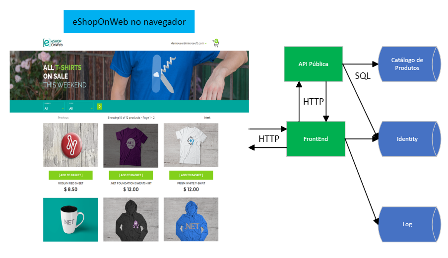
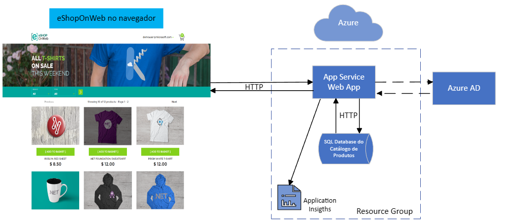

### FIAP Pós Tech
#### Especialização em Arquitetura de Sistemas .NET com Azure: Fase I - Disciplina I - Aula 5 - Challenge 1

# 0. Versionamento
| Data          | Versão        | Descrição                                  | Autor             |
| ------------- | ------------- | ----------------------                     | ----------------- |
| 12/05/2023    | 1.0           | Criação do documento                       | André Batemarchi  |
| 24/05/2023    | 1.1           | Ajustes de termos do Azure para o inglês e outras correções textuais   | André Batemarchi | 

# 1. Considerações Preliminares e Motivação
Sabemos que é muito comum hoje soluções em nuvem ([Microsoft, 2023](https://dotnet.microsoft.com/en-us/download/e-book/aspnet/pdf)). Dentre as vantagens dessa tecnologia estão: custo, escalabilidade, segurança e várias outras.

Projetar uma aplicação em nuvem envolve determinados conhecimentos de arquitetura que serão discutidos aqui. Neste desafio da **Pós Tech da FIAP - Arquitetura de Sistemas .NET com Azure** é proposto um projeto de uma aplicação em nuvem baseado no [eShopOnWeb](https://github.com/dotnet-architecture/eShopOnWeb), que é um modelo de aplicação de loja online provido pela Microsoft. Seja a arquitetura do projeto em questão apresentada a seguir:

**Fonte:** baseado em Microsoft - [eShopOnWeb](https://github.com/dotnet-architecture/eShopOnWeb)

A aplicação **eShopOnWeb** não está na nuvem e pode ser testada localmente ([vide repositório da Microsoft](https://github.com/dotnet-architecture/eShopOnWeb)). Sendo assim, a partir de cada componente da arquitetura apresentada, devemos elaborar uma lista de procedimentos necessários para implementar a solução em nuvem. Cada componente será apresentado nas próximas seções, com as seguintes informações:

- Nome do procedimento para implementar o componente em nuvem;
- Breve descrição do procedimento;
- Ferramentas e recursos (*resources*) utilizados para implantação da solução em nuvem;
- Conhecimentos específicos para realizar a implantação.

Por fim, ressalta-se que este repositório abarcará a teoria, ou modelo de arquitetura, por enquanto. No futuro, conforme se avança na Pós Graduação, será feito push do código, configurações e ferramentas necessários para implantação da aplicação em nuvem.

# 2. Aplicação Web
Como vimos na figura da seção anterior, o **eShopOnWeb** é uma aplicação web, contendo uma API, que se comunica com uma camada de apresentação (cliente) via requisições HTTP. Em primeiro lugar, temos 3 opções para *levar* a aplicação à nuvem Azure:

1. Por meio de App Service Apps (solução PaaS);
2. Usando contêineres;
3. Com máquinas virtuais (solução IaaS).

Vamos considerar a primeira abordagem, conforme indicação da [Microsoft](https://dotnet.microsoft.com/en-us/download/e-book/aspnet/pdf). Sendo assim, temos:

**Nome do procedimento:** Criar um Web App.

**Descrição:** criar o *resource* no portal do Azure e informar os parâmetros necessários.

**Ferramentas e resources:** algumas considerações sobre os parâmetros do **Web App**:

- Podemos criar um novo *resource group*.
- Publicar na forma de código (abordagem escolhida), apontando para nosso repositório com código do Cliente + API.
- Usaremos o *.NET 7*.
- Configuraremos o banco de dados na próxima seção.
- Usaremos o *GitHub* para implantação.
- Usaremos o *Application Insights* para monitoramento.
- Rotularemos (via *tags*) a nossa app para melhor identificação do *resource* na nuvem.
  
**Conhecimentos para realizar a implantação:** vimos que precisamos saber a versão do framework utilizado (.NET 7), gerenciamento de código com *Git* e *CI/CD* (com *Azure DevOps*, por exemplo) para *subir* a aplicação, ter conhecimentos específicos sobre as capacidades do Azure, como *resource groups* e *application insights* e conhecimentos sobre infraestrutura de nuvem para definir os parâmetros que não foram citados, como região, redundância e disponibilização para o público, úteis para definir questões de restrições de acesso, rede, latência e procotolos utilizados.

# 3. Banco de Dados
O banco do **eShopOnWeb** é um SQL Server tradicional. Ele é acessado por meio da API pública da aplicação. Para migrá-lo para a nuvem, temos os seguintes *resources*:

1. **Azure SQL Database**;
2. Azure Blob Storage;
3. Cosmos DB (para bancos não-relacionais).

Prezando pela performance, escolheremos o primeiro *resource* ([Microsoft, 2023](https://dotnet.microsoft.com/en-us/download/e-book/aspnet/pdf)). Então:

**Nome do procedimento:** Criar um *resource* de Azure SQL Database.

**Descrição:** criar um serviço de banco de dados SQL no portal do Azure e informar os parâmetros necessários.

**Ferramentas e resources:** algumas considerações sobre os parâmetros:

- Vamos usar o *resource group* que já criamos;
- Definiremos um nome conveniente e legível para o BD e criaremos um servidor e um tipo de redundância.
- Definiremos os parâmetros de rede e segurança para que o BD seja acessível pela aplicação por meio de uma rede. 
- Podemos iniciar o BD do zero (baseado no **eShopOnWeb**) ou importar dados em *Additional settings*.
- Devemos retornar ao código para realizar as devidas conexões com o BD em nuvem.

**Conhecimentos para realizar a implantação:** além de conhecimentos específicos sobre rede, sistemas distribuídos e segurança, precisamos entender bancos de dados relacionais e como configurá-los via Configurations (após criar o *resource*).

# 4. Identity
O **eShopOnWeb** possui um BD com informações de login e mecanismos de Autenticação e Autorização. O Cliente possui a funcionalidade de login (autenticação) e outras funcionalidades de compras, utilizadas por meio de chamadas de endpoints (autorização). O *Identity* usado pelo .NET neste caso pode *ir para a nuvem* das seguintes formas:

1. Via novo BD com as informações de login do usuário;
2. **Via integração com o Azure Active Directory (AAD).**

Usaremos a segunda opção. Esta é uma abordagem muito robusta e não entraremos nos detalhes. Mas, é por meio do *AAD* que os usuários da nossa aplicação podem realizar [logon único](https://azure.microsoft.com/en-us/products/active-directory/) com toda a infraestutura e segurança garantida pela Microsoft.

**Nome do procedimento:** Criar um *resource* **Assigned Managed Identity** no Azure.

**Descrição:** criar o *resource* no portal do Azure, informar os parâmetros necessários e atribuir aos nossos *resources* de nuvem.

**Ferramentas e resources:** devemos entender como configurar corretamente contas e permissões de usuários a *resources* do Azure. Além disso, devemos voltar ao código e configurar o uso do *Identity* provido pelo *AAD*.

# 5. Logs
Os logs podem ser implementados em nuvem de várias maneiras. Vejamos algumas a seguir:

1. Utilizando um novo BD na nuvem.
2. Via ferramentas de terceiros.
3. **Via Azure Monitor Service.**

O Azure tem um arcabouço de serviços disponíveis para monitoramento via *logging* e telemetria. Por meio do Monitor, podemos configurar *resources* como *application insights, logs, Log stream* e vários outros. 

**Nome do procedimento:** Habilitar *logging* da nossa aplicação no Azure.

**Descrição:** fazer uma **Configuração de Diagnóstico**, via **Azure Monitor Service**, conforme necessidades de desenvolvimento.

**Ferramentas e resources:** devemos entender como configurar corretamente o monitoramento de acordo com as necessidades de desenvolvimento, via **Diagnostic Settings** e outras opções possíveis do **Azure Monitor Service**. Podemos também configurar informações de Analytics úteis  para contabilizar métricas relacionadas aos requisitos não funcionais do negócio. Algumas configurações podem requerer codificação complementar em nossa aplicação.

# 6. Arquitetura Proposta para o Desafio
*Amarrando* o que foi apresentado até aqui e inspirado em ([Microsoft, 2023](https://dotnet.microsoft.com/en-us/download/e-book/aspnet/pdf)), propõe-se a seguinte arquitetura para o projeto **eShopOnWeb** na nuvem Azure:

**Fonte:** inspirado em ([Microsoft, 2023](https://dotnet.microsoft.com/en-us/download/e-book/aspnet/pdf))

Temos, dentro do *Resource Group* da nossa solução, dois *resources* de nuvem organizados logicamente:

1. O *resource* **Web App** recebe requisições e retorna resultados para o navegador do usuário. Para as requisições, este *resource* deve tratar a autenticação e a autorização com *Identities* do *Azure Active Directory*. Os *resources* são obtidos e persistidos por meio do *resource* **SQL Database**. O processamento é controlado pelo *Monitor Service*, que disponibiliza *application insights* para o sistema.
2. O **SQL Database do Catálogo de Produtos** armazena os dados da loja online.

Dessa forma, temos a versão **eShopOnCloud**, que utiliza a nuvem Microsoft e suas capacidades para implantar uma aplicação de loja online na internet.

# 7. Conclusões
Em vista do que foi apresentado, a plataforma Azure permite com que seja realizada implantação de aplicações em nuvem muito úteis e valiosas nos dias atuais. Elaborar a arquitetura dessas aplicações não é uma tarefa trivial, mas a plataforma da Microsoft nos fornece um grande arcabouço de possibilidades para implantarmos nossas soluções sem muitos problemas.

# 8. Referências

1. [Azure Active Directory](https://azure.microsoft.com/en-us/products/active-directory/)
   
2. [Architecting Modern Web Applications with ASP.NET Core and Microsoft Azure](https://dotnet.microsoft.com/en-us/download/e-book/aspnet/pdf)

3. [eShopOnWeb](https://github.com/dotnet-architecture/eShopOnWeb)
