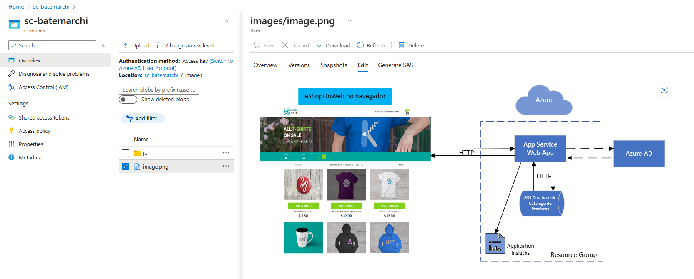

### FIAP Pós Tech
#### Especialização em Arquitetura de Sistemas .NET com Azure: Fase I - Disciplina II - Aula 7 - Challenge 2

# 0. Versionamento
| Data          | Versão        | Descrição                                  | Autor             |
| ------------- | ------------- | ----------------------                     | ----------------- |
| 24/05/2023    | 1.0           | Criação do documento                       | André Batemarchi  |

# 1. Considerações Preliminares e Motivação
Podemos provisionar *resources* no Azure via Portal e usando prompts de comando, como Azure CLI. Esta opção é bastante prática e muito utilizada por devs e arquitetos. A ideia deste desafio é: utilizando uma interface CLI, fazer o upload de uma imagem armazenada em ambiente local para a nuvem, em um container do Azure.

# 2. Resolvendo o Desafio
Primeiramente apresentarei o passo a passo necessário para resolver o desafio, em seguida, os comandos utilizados e, por fim, o resultado.

**Passo a passo:**

1. Logar no Azure.
2. Criar um *resource group* para organizar os resources.
3. Criar um *storage account* para definir uma *unidade de disco* para armazenar blobs na nuvem e o respectivo *tier*.
4. Criar um container para armazenar blobs - *Azure Blob Storage*.
5. Fazer upload da imagem no Azure.

**Comandos:**

1. az login
2. az group create --name rg-batemarchi --location brazilsouth
3. az storage account create --name sabatemarchi --resource-group rg-batemarchi --location brazilsouth --sku Standard_LRS
4. az storage container create --name sc-batemarchi --account-name sabatemarchi
5. Se estiver em um shell do Windows, obter a chave da conta e, depois, usá-la no comando de upload:
   1. az storage account keys list --resource-group rg-batemarchi --account-name sabatemarchi
   2. az storage blob upload --account-name sabatemarchi --account-key **UmaChaveObtidaNoPassoAnterior** --type block --name images/image.png --file C:\Users\andre\Desktop\arq2.png --container-name sc-batemarchi
6. Se estiver em um shell compatível com comandos bash:
   1. az storage blob upload --account-name sabatemarchi --account-key $(az storage account keys list --resource-group rg-batemarchi --account-name sabatemarchi --query [0].value -o tsv) --type block --name images/image.png --file C:\Users\andre\Desktop\arq2.png --container-name sc-batemarchi

**Resultado (portal Azure):**

# 3. Conclusões
É possível provisionar *resources* na nuvem Azure de forma simples e prática. Precisamos identificar qual é o *tier* para tanto e ter o devido cuidado com os comandos e sintaxe correta. Podemos fazer upload de arquivos e mantê-los na nuvem de maneira a aproveitar as capacidades da infraestrutura da Microsoft.

# 4. Referência

1. [Azure Command-Line Interface (CLI) documentation
](https://learn.microsoft.com/en-us/cli/azure/)
