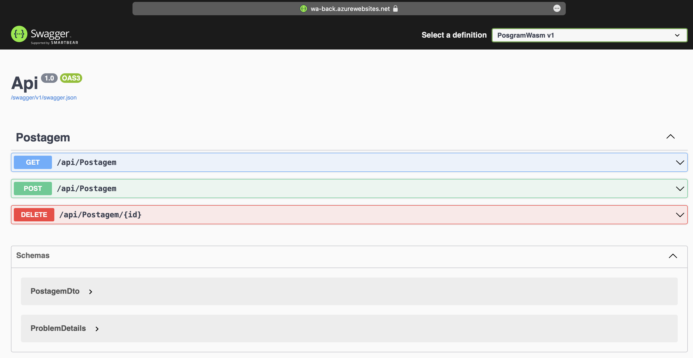

### FIAP Pós Tech
#### Especialização em Arquitetura de Sistemas .NET com Azure: Fase II - Disciplina I - Aula 6 - Challenge 3

# 0. Versionamento
| Data          | Versão        | Descrição                                  | Autor             |
| ------------- | ------------- | ----------------------                     | ----------------- |
| 21/08/2023    | 1.0           | Criação do documento                       | André Batemarchi  |

# 1. Considerações Preliminares e Motivação
Podemos portabilizar aplicações completas por meio de containers. Nesse sentido, o Azure nos fornece 2 serviços úteis: o Azure Container Registry (ACR) para lidar com imagens e o Azure Container Instances (ACI) para a execução de containers na nuvem.

# 2. Resolvendo o Desafio
Vamos utilizar o trabalho desenvolvido no Tech Challenge I. Trata-se de uma aplicação completa com uma camada de frontend, uma de back (API), um BD SQL Server e também faz uso do Container Storage para armazenamento de BLOBs. Para resolver este desafio, utilizaremos o passo a passo apresentado:

**Passo a passo:**

1. Clonar o repositório do projeto PosgramWasm: https://github.com/Andygrammer/TechChallenge1.
2. Renomear *Dockerfile-front* (fornecido na pasta res) para *Dockerfile* e adicionar na pasta do projeto WebBlazor.
3. Renomear *Dockerfile-back* para *Dockerfile* e adicionar na pasta do projeto Api.
4. Criar um resource group para o projeto.
5. Usar o Dockerfile para criar uma imagem para o front e subir no ACR.
6. Usar o Dockerfile para criar uma imagem para o back e subir no ACR.
7. Criar um container no ACI para executar o front.
8. Criar um container no ACI para executar o back.
9. Criar um storage account para usar o storage do Azure.
10. Criar um storage container para armazenamento de BLOBs.
11. Criar um service plan para a app.
12. Criar um resource do tipo web app para o front.
13. Criar um resource do tipo web app para o back.
14. Criar um resource de servidor de BD.
15. Criar um resource de BD SQL Server.
16. Fazer os migrations (obter a connection string gerada no passo anterior).

**Comandos:**

1. az login
2. az group create --name rg-batemarchi --location brazilsouth
3. az acr create --resource-group rg-batemarchi --name postechchallenge1acr --sku Basic --admin-enabled true
4. az acr build --image aspnetimage:v1 --registry postechchallenge1acr --file Dockerfile .
5. az acr build --image aspnetimageback:v1 --registry postechchallenge1acr --file Dockerfile .
6. az container create --resource-group rg-batemarchi --name frontaci --image postechchallenge1acr.azurecr.io/aspnetimage:v1 --dns-name-label frontaci --ports 443
7. az container create --resource-group rg-batemarchi --name backaci --image postechchallenge1acr.azurecr.io/aspnetimageback:v1 --dns-name-label backaci --ports 80
8. az storage account create --name sabatemarchi --resource-group rg-batemarchi --location brazilsouth --sku Standard_LRS
9. az storage container create --name sc-postechchallenge1 --account-name sabatemarchi --account-key MINHA_CHAVE_SUBS
10. az appservice plan create --name sp-postechchallenge1 --resource-group rg-batemarchi --sku F1 --location brazilsouth --is-linux
10. az webapp create --name wa-front --resource-group rg-batemarchi --plan sabatemarchi -i postechchallenge1acr.azurecr.io/aspnetimage:v1
11. az webapp create --name wa-back --resource-group rg-batemarchi --plan sabatemarchi -i postechchallenge1acr.azurecr.io/aspnetimageback:v1
12. az sql server create --name db-postechchallenge1 --location brazilsouth --resource-group rg-batemarchi --admin-user nomeBD --admin-password senhaBD
13. az sql db create --resource-group rg-batemarchi --server db-postechchallenge1 --name sql-postechchallenge1 --service-objective S0 --zone-redundant false --backup-storage-redundancy Local

**Resultado (API):**

# 3. Conclusões
É possível provisionar uma aplicação completa usando containers e a nuvem Azure de forma simples e prática. Os serviços ACR e ACI nos fornecem um ambiente robusto para provisionamento e execução de containers.

# 4. Referências

1. [Azure Container Registry](https://azure.microsoft.com/en-us/products/container-registry)

2. [Container Instances](https://azure.microsoft.com/en-us/products/container-instances)

