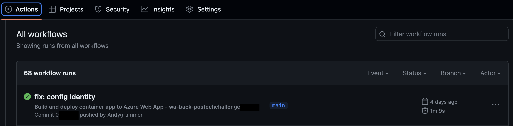

### FIAP Pós Tech
#### Especialização em Arquitetura de Sistemas .NET com Azure: Fase II - Disciplina II - Aula 11 - Challenge 4

# 0. Versionamento
| Data          | Versão        | Descrição                                  | Autor             |
| ------------- | ------------- | ----------------------                     | ----------------- |
| 21/08/2023    | 1.0           | Criação do documento                       | André Batemarchi  |

# 1. Considerações Preliminares e Motivação
Podemos publicar automaticamente nossas aplicações utilizando o GitHub Actions. Podemos configurá-lo (para fazer CI/CD) no nosso resource de web app ou via yml, que por sua vez deve ficar no diretório: */.github/workflows*.

# 2. Resolvendo o Desafio
Para resolver o desafio, fornecemos os seguintes exemplos para deploy automático a partir de um push no branch main:

- Exemplo 1: [aplicação contida em um resource de web app](../res/deploy-app.yml)
- Exemplo 2: [aplicação contida em um container](../res/deploy-container.yml)

**Resultado (GitHub):**

# 3. Conclusões
É possível usar o GitHub Actions para montar e publicar nossas aplicações automaticamente. Podemos utilizar o próprio portal do Azure ou criar um arquivo yml para fazer CI/CD com o GitHub Actions. O processo é simples e prático.

# 4. Referência

1. [What is GitHub Actions for Azure](https://learn.microsoft.com/en-us/azure/developer/github/github-actions)

